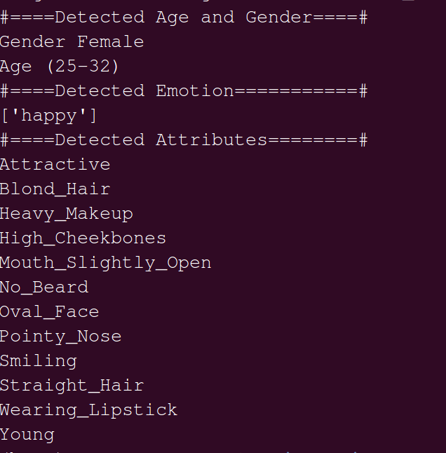

# AI ML - Human Attributes Detection with Facial Feature Extraction

## Age, Emotion, Gender recognition with Facial feature extraction

This facial attribute extraction program detects facial coordinates using FaceNet model and uses MXNet facial attribute extraction model for extracting 40 types of facial attributes. This solution detects Emotion, Age and Gender along with facial attributes.

Deep Learning Models used for the library are,

- FaceNet model used for facial landmark recognition.
- A trained lightened moon Mxnet model used for facial attribute extraction.
- AgeNet pre-trained caffe model used for Age detection.
- GenderNet caffe model used for Gender detection.

## Table of contents

- [Getting started](#getting-started)
- [Features](#features)
- [Facial Attribute Classes](#facial-attribute-classes)
- [Emotion Detection Classes](#emotion-detection-classes)
- [Gender Detection Classes](#gender-detection-classes)
- [Age Detection Classes](#age-detection-classes)
- [Usage](#usage)
- [Results](#results)
- [Want to Contribute?](#want-to-contribute)
- [Need Help / Support?](#need-help)
- [Collection of Other Components](#collection-of-components)
- [Changelog](#changelog)
- [Credits](#credits)
- [License](#license)
- [Keywords](#Keywords)

## Getting started

Prerequisites for running the code are:

- Python == 3.6
- python-opencv == 4.2.0
- numpy == 1.18.5
- pandas == 0.24.2
- Keras == 2.2.4
- mxnet == 1.6.0
- python-dotenv == 0.14.0
- imageio == 2.4.1

We have tested our program in above version, however you can use it in other versions as well.

### Update path in .env file
    
    Replace "your/path/to/folder/" in .env file with path of your system.
    
    My username is abc, replace that with your system username.
    
    Eg: FACEDETECTOR = "/home/abc/AIML-Human-Attributes-Detection-with-Facial-Feature-Extraction/model/facenet/opencv_face_detector.pbtxt"

## Features

- Face detection using FaceNet model
- Detects facial attribute of a face in an image.
- Detects Emotions on the face.
- Predicts Gender of the detected face.
- Predicts Age of the detected face.

### Facial Attribute Classes

    ["5_o_Clock_Shadow","Arched_Eyebrows","Attractive","Bags_Under_Eyes","Bald", "Bangs","Big_Lips","Big_Nose",
    "Black_Hair","Blond_Hair","Blurry","Brown_Hair","Bushy_Eyebrows","Chubby","Double_Chin","Eyeglasses","Goatee",
    "Gray_Hair", "Heavy_Makeup","High_Cheekbones","Male","Mouth_Slightly_Open","Mustache","Narrow_Eyes","No_Beard",
    "Oval_Face","Pale_Skin","Pointy_Nose","Receding_Hairline","Rosy_Cheeks","Sideburns","Smiling","Straight_Hair",
    "Wavy_Hair","Wearing_Earrings","Wearing_Hat","Wearing_Lipstick","Wearing_Necklace","Wearing_Necktie","Young"] 
    
### Emotion Detection Classes

   - Happy
   - Neutral
   - Surprise
   - Angry
   - Fear
   - Sad
   - Disgust

### Gender Detection Classes

   - Male
   - Female

### Age Detection Classes

    ['(0-2)', '(4-6)', '(8-12)', '(15-20)', '(25-32)', '(38-43)', '(48-53)', '(60-100)']
    
## Usage

Inside the project's directory run:

```
python predict.py
```
You can find sample images in the Dataset folder and results can be seen on the terminal. Results directory contains images with detected faces.


### Results
#### Original Image


#### Detection Results



## Want to Contribute?

- Created something awesome, made this code better, added some functionality, or whatever (this is the hardest part).
- [Fork it](http://help.github.com/forking/).
- Create new branch to contribute your changes.
- Commit all your changes to your branch.
- Submit a [pull request](http://help.github.com/pull-requests/).

-----

## Need Help? 

We also provide a free, basic support for all users who want to use image processing techniques for their projects. In case you want to customize this image enhancement technique for your development needs, then feel free to contact our [AI/ML developers](https://www.weblineindia.com/ai-ml-dl-development.html).

-----

## Collection of Components

We have built many other components and free resources for software development in various programming languages. Kindly click here to view our [Free Resources for Software Development](https://www.weblineindia.com/software-development-resources.html).

------

## Changelog

Detailed changes for each release are documented in [CHANGELOG.md](./CHANGELOG.md).

## Credits

- Refered mxnet-face for attribute extraction.  [mxnet-face](https://github.com/tornadomeet/mxnet-face).
- Refered fer2013/IMDB for emotional classification.  [fer2013/IMDB](https://github.com/oarriaga/face_classification).
- Refered AgeGender recognition.  [AgeGender](https://github.com/spmallick/learnopencv/tree/master/AgeGender).

## License

[MIT](LICENSE)

[mit]: https://github.com/miguelmota/is-valid-domain/blob/e48e90f3ecd55431bbdba950eea013c2072d2fac/LICENSE

## Keywords

 Mxnet_face, facial_attribute_extraction, Age_recognition, gender_recognition, emotion_recognition, caffemodel, fer2013

